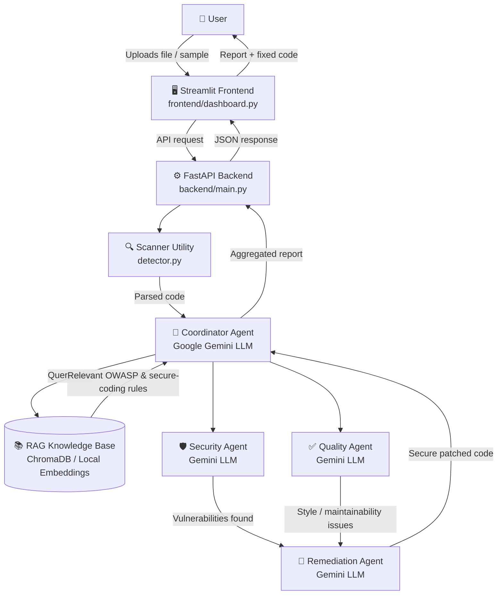

# 🤖 AI Code Review & Security Analysis Agent

An intelligent, multi-agent code review and security analysis system built for automated vulnerability detection, quality enforcement, and code remediation. Powered by the **Google Gemini LLM**, a **FastAPI** backend, **Streamlit** frontend, and a **RAG-based vector knowledge base**.

---

## 📂 Repository Layout

```text
ai-code-review-security-analysis/
├── backend/                  <-- Core backend logic (FastAPI, agents, main.py)
├── frontend/                 <-- Streamlit dashboard script
├── knowledge_base/           <-- RAG reference documentation
├── test_cases/               <-- Sample vulnerable files for live demos
├── detector.py               <-- Code analysis and scanning utility
├── .gitignore                <-- Must include .env and __pycache__/
├── requirements.txt          <-- Project dependencies
└── README.md                 <-- Project documentation


# 🤖 AI Code Review & Security Analysis Agent

An intelligent, multi-agent code review and security analysis system built for automated vulnerability detection, quality enforcement, and code remediation. Powered by the **Google Gemini LLM**, a **FastAPI** backend, **Streamlit** frontend, and a **RAG-based vector knowledge base**.

---

## 🏛️ System Architecture (Diagram)



---

## 📂 Repository Layout

```text
ai-code-review-security-analysis/
├── backend/                  <-- Core backend logic (FastAPI, agents, main.py)
├── frontend/                 <-- Streamlit dashboard script
├── knowledge_base/           <-- RAG reference documentation
├── test_cases/               <-- Sample vulnerable files for live demos
├── detector.py                <-- Code analysis and scanning utility
├── .gitignore                 <-- Must include .env and __pycache__/
├── requirements.txt           <-- Project dependencies
└── README.md                  <-- Project documentation
```

---

## 🏗️ System Architecture & Component Mapping

| Component / Module | Technology / LLM Used | Core Responsibility |
|---|---|---|
| Frontend Interface | Streamlit | Provides the interactive dashboard for users to upload files, trigger scans, and view remediation reports. |
| Backend API | FastAPI (Python) | Handles asynchronous routing, session state, and orchestration between the UI and analysis agents. |
| Coordinator Agent | Google Gemini LLM | Directs the workflow, manages multi-agent handoffs, and synthesizes final reports. |
| Security Agent | Google Gemini LLM | Deeply inspects code for vulnerabilities, injection flaws, and security anti-patterns. |
| Quality Agent | Google Gemini LLM | Evaluates code cleanliness, readability, maintainability, and standard formatting practices. |
| Remediation Agent | Google Gemini LLM | Automatically generates secure, corrected code implementations for identified issues. |
| RAG System | ChromaDB / Local Embeddings | Retrieves relevant security standards, OWASP guidelines, and reference documentation to ground agent decisions. |
| Scanner Utility | detector.py | Performs the initial file parsing and syntax checking before agent processing. |

---

## 🔄 End-to-End Workflow

1. **Code Ingestion** — The user uploads a source file (or selects a sample from `test_cases/`) via the Streamlit dashboard frontend.
2. **Preprocessing & Parsing** — The FastAPI backend receives the file, and `detector.py` scans and parses the raw text structure.
3. **Context Retrieval (RAG)** — The system queries the `knowledge_base/` vector store to fetch relevant secure-coding rules and compliance guidelines matching the language/framework.
4. **Agent Orchestration**:
   - The **Coordinator Agent** assigns tasks to specialized sub-agents powered by the Google Gemini LLM.
   - The **Security Agent** scans for vulnerabilities.
   - The **Quality Agent** checks code style and metrics.
5. **Remediation Generation** — If flaws or vulnerabilities are discovered, the **Remediation Agent** formulates a secure, production-ready patch using context from the RAG knowledge base.
6. **Reporting** — The aggregated analysis, security scores, and fixed code blocks are sent back through FastAPI and displayed seamlessly on the Streamlit dashboard.

---

## 📦 Project Libraries & Dependencies

The project relies on 6 core modern Python libraries specified in `requirements.txt`:

| Library Name | Primary Role / Purpose in the Project |
|---|---|
| `streamlit` | Powers the interactive frontend user dashboard where users upload files and view security reports. |
| `fastapi` | Provides the asynchronous backend API framework that coordinates routes and agent logic. |
| `uvicorn` | Acts as the ASGI server used to host and run the FastAPI backend application. |
| `google-generativeai` | The official Google SDK connecting the multi-agent architecture directly to the Google Gemini LLM. |
| `chromadb` | Manages the local vector database for the RAG knowledge base, storing semantic embeddings of security standards and OWASP guidelines. |
| `python-dotenv` | Safely loads sensitive credentials (such as the Gemini API key) from the local `.env` file into the runtime environment. |

---

## ⚙️ Installation & Setup

### 1. Clone the Repository
```bash
git clone https://github.com/your-username/ai-code-review-security-analysis.git
cd ai-code-review-security-analysis
```

### 2. Install Dependencies
```bash
pip install -r requirements.txt
```

### 3. Configure Environment Variables
Create a `.env` file inside the `backend/` directory and add your secure Gemini API key:

```
GEMINI_API_KEY=your_actual_gemini_api_key_here
```

> **Note:** Never commit your `.env` file to version control. It is protected via `.gitignore`.

---

## 🏃‍♂️ Running the Application

### Step 1: Start the FastAPI Backend
```bash
cd backend
uvicorn main:app --reload
```

### Step 2: Launch the Streamlit Dashboard
Open a new terminal window from the root directory and run:
```bash
streamlit run frontend/dashboard.py
```

---

## 🧪 Live Demonstrations (test_cases)

The repository includes pre-built sample files (`test_cases/vulnerable_sample.py` and `test_cases/vulnerable_sample.java`) containing common vulnerabilities. You can upload these directly into the Streamlit dashboard during live evaluations to demonstrate real-time threat detection and automated remediation.

---

## 🔒 Security Best Practices

- API keys are exclusively handled via environment variables (`.env`).
- Temporary scan files and Python cache (`__pycache__/`) are excluded from tracking via `.gitignore`.